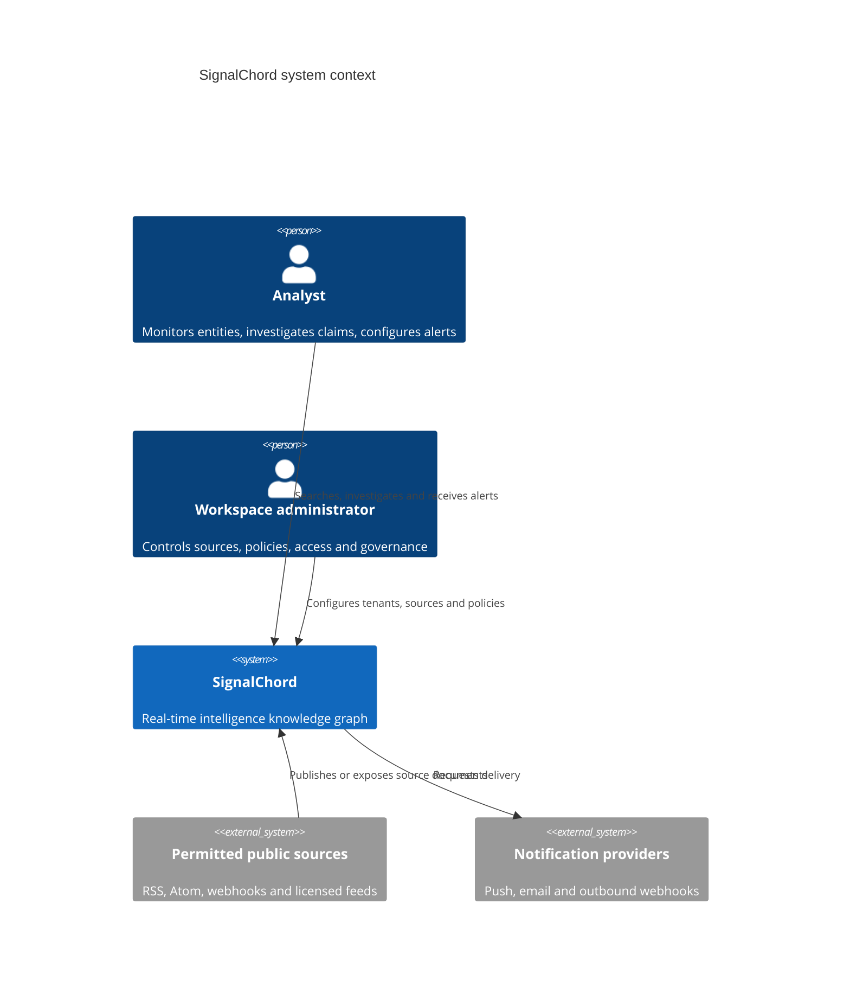
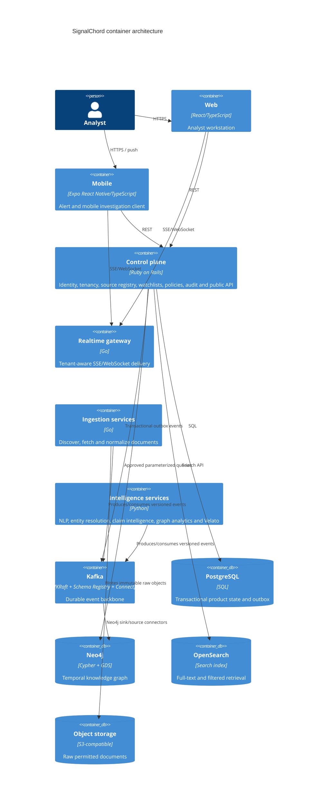
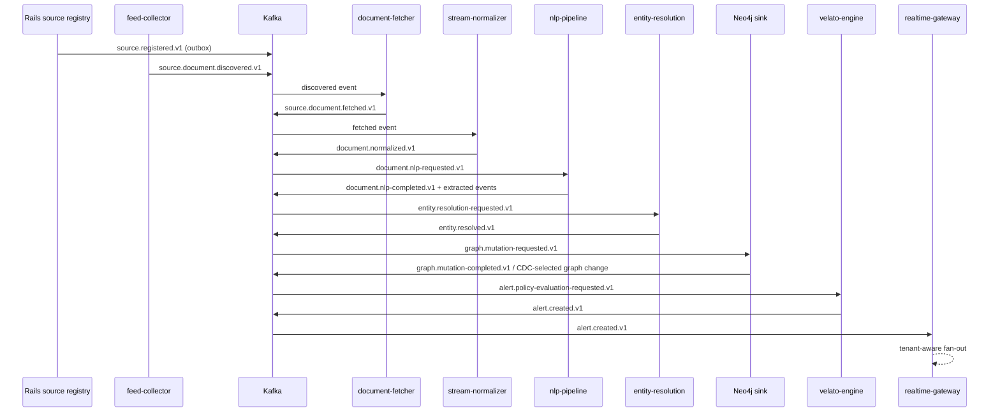

# SignalChord architecture

## Executive view

SignalChord turns permitted source documents into explainable, replayable intelligence. Kafka is the durable processing backbone; Neo4j is the relationship source of truth; PostgreSQL owns transactional product configuration; object storage owns permitted raw documents; OpenSearch owns full-text retrieval indexes.

The system uses a small number of domain-aligned services rather than one service per operation. Latency-sensitive collection and streaming gateways are Go. Semantic processing is typed Python. The Rails application owns identity, tenancy, billing, governance and user-authored product state. React and React Native consume versioned APIs and real-time events.

## Architectural invariants

1. Every externally derived assertion retains document, source, extractor and model provenance.
2. Source reports, model extractions, graph inferences and human verification are distinct states.
3. Kafka consumers are at-least-once and idempotent. Kafka transactions are used only for consume-transform-produce stages where they materially reduce ambiguity.
4. Event time is source publication/observation time when available; ingestion time is never substituted silently.
5. Low-confidence entity matches remain candidates; they are not silently merged.
6. Clients cannot submit arbitrary Cypher. Graph access uses approved, parameterized query templates.
7. Tenant identifiers are carried through API calls, events, graph elements, cache keys, object paths and audit records.
8. Velato execution is deterministic, resource-bounded and isolated from network, filesystem, shell and native-code access.

## C4 context

## C4 containers

## Article-to-alert vertical slice

## Data ownership and consistency

| Store | Authoritative for | Reconciliation rule |
|---|---|---|
| PostgreSQL | users, organizations, workspaces, RBAC, sources, watchlists, policies, subscriptions, audit metadata | transactional outbox is replayed until acknowledged; no graph fact duplication |
| Kafka | ordered processing history within stable keys | schemas are backward compatible; consumer offsets can be reset from documented checkpoints |
| Object storage | immutable permitted raw document bytes and fetch metadata | key is tenant/source/content hash; deletion tombstone prevents re-ingestion |
| Neo4j | graph nodes, relationships, temporal validity, evidence links and graph-derived signals | mutations are idempotent `MERGE` operations keyed by stable IDs |
| OpenSearch | full-text/search projection | rebuilt from normalized documents and entity projections; never authoritative |
| Redis | ephemeral caches, rate limits and subscription state | disposable; no durable business state |

## Delivery semantics

- Discovery, fetch, extraction and graph mutation consumers are at-least-once with idempotency keys.
- Consume-transform-produce stages use Kafka transactions when both input offsets and output records can be committed atomically.
- External side effects use an inbox/idempotency ledger and retryable state machine.
- Late events are accepted within per-topic windows and marked with `lateness_ms`; graph mutations compare `observed_at` and `valid_from` before superseding state.
- Dead-letter records include original payload bytes, schema ID, exception class, stack fingerprint, attempts and replay eligibility.

## Multi-tenant model

All product-owned records contain `tenant_id`. Shared public entities may exist in a global canonical layer, but tenant-specific watchlists, investigations, annotations, alerts and private sources remain tenant scoped. The graph-query service injects tenant predicates and rejects templates without declared isolation rules.

## Operational deployment

Local development uses Docker Compose. Production uses Helm/Kubernetes with separate node pools for Kafka, Neo4j, stateful datastores and stateless services. Terraform provisions network, identities, secrets, object storage, managed DNS and optional managed Kafka/Neo4j equivalents.

## Unresolved architecture decisions

- Exact licensed-source mix and per-source retention constraints.
- Initial production NLP models and inference hosting strategy.
- Whether global canonical entities are enabled for all plans or enterprise-only.
- Push provider and mobile background-delivery limits.
- The supported Velato subset after compatibility testing against the original interpreter.
