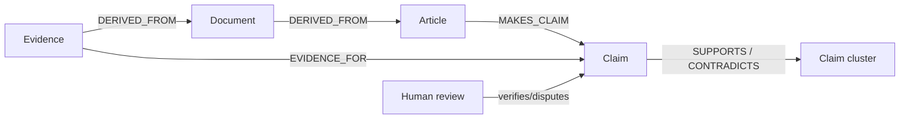

# Neo4j temporal knowledge-graph model

## Modeling approach

SignalChord separates source material, extracted assertions, inferred signals and human verification. `Evidence` is explicit and every model-created node or relationship carries provenance, temporal and confidence metadata.

## Core nodes

`Article`, `Document`, `Source`, `Publisher`, `Author`, `Person`, `Organization`, `Company`, `GovernmentAgency`, `Location`, `Country`, `Industry`, `Product`, `Event`, `Claim`, `Topic`, `Investigation`, `Alert`, `Policy`, `Evidence`, `Watchlist`.

Public canonical entities may be shared; tenant-private nodes always contain `tenant_id`. A tenant cannot traverse to private nodes belonging to another tenant.

## Core relationships

`PUBLISHED`, `AUTHORED`, `MENTIONS`, `ABOUT`, `MAKES_CLAIM`, `SUPPORTS`, `CONTRADICTS`, `CORROBORATES`, `RELATED_TO`, `LOCATED_IN`, `WORKS_FOR`, `ACQUIRED`, `INVESTED_IN`, `PARTNERED_WITH`, `COMPETES_WITH`, `REGULATES`, `AFFECTS`, `PRECEDES`, `DERIVED_FROM`, `EVIDENCE_FOR`, `TRIGGERED`, `WATCHES`, `MEMBER_OF`.

## Mandatory extracted properties

| Property | Meaning |
|---|---|
| `stable_id` | Deterministic identifier independent of database-internal IDs |
| `tenant_id` | Tenant scope where applicable |
| `created_at`, `updated_at` | Platform persistence timestamps |
| `valid_from`, `valid_to` | Real-world validity interval, nullable when unknown |
| `observed_at` | Earliest source observation/event time |
| `extraction_model`, `extraction_version` | Producing model identity |
| `confidence` | Calibrated 0–1 score, never a truth flag |
| `status` | candidate, model_verified, human_verified, disputed or retracted |
| provenance IDs | document, source, evidence and event identifiers |

## Evidence-first pattern

A relationship candidate such as `PARTNERED_WITH` is not unquestioned fact: its relationship properties retain status, confidence and evidence IDs. Sensitive conclusions remain candidates until policy-defined review conditions are met.

## Temporal changes

Material changes create a new relationship version with a new stable relationship ID or close the prior version using `valid_to`; historical values are not overwritten. Retractions change status and append an audit/evidence trail rather than deleting the prior observation.

## Identity and merge safety

Entity resolution emits accepted and alternate candidates. Only deterministic or threshold-approved matches become canonical automatically. Manual merge records preserve both original IDs and support unmerge by replaying surviving provenance-linked relationships.

## Constraints and indexes

Repeatable scripts in `graph/migrations` create uniqueness constraints for stable IDs, composite uniqueness for tenant-private alerts and indexes for normalized names, event time, validity intervals and tenant lookup.

## Approved query templates

`graph/queries/examples.cypher` includes entity timelines, bounded shortest paths, contradictory/corroborated claims, source diversity, emerging relationship inputs, watched-entity articles, organization relationship changes, multi-publisher propagation and event-to-company paths. Clients never submit arbitrary Cypher.
